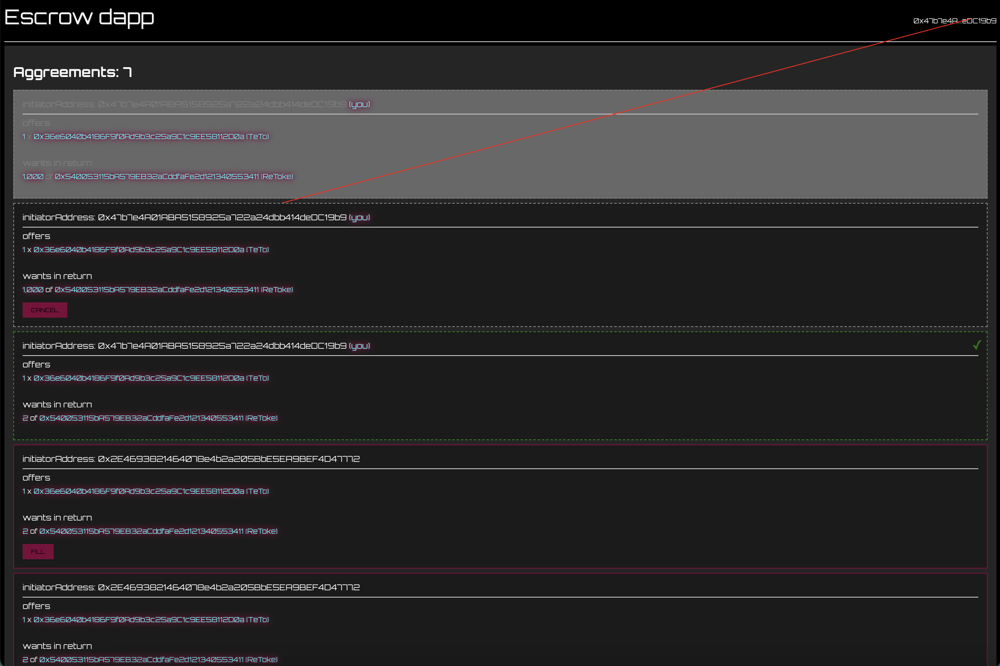

# escrow

A one contract dapp which facilitates the escrow exchange of two currencies on an EVM compatible chain.

An initiator creates an agreement, stating which currency they'll provide and how much - and likewise the currency and quanity they would like in exchange.

They can cancel the agreement at any time until it is filled.

Someone with a different public address to that of the initiator can fill the agreement.

### possible escrow next steps

- better get approval need
- can I get loading state of tx
